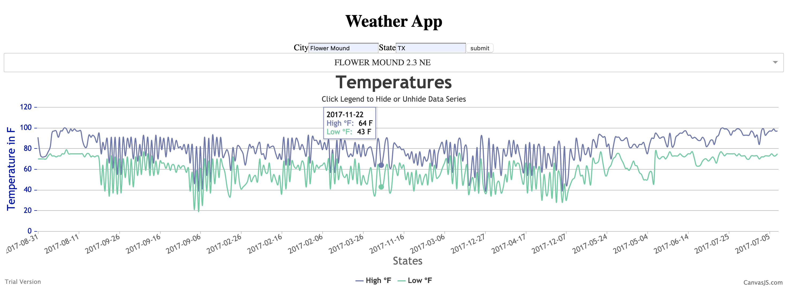

# Weather Application

## What is does the app do?
The application is a simple weather application that shows the historical temperature data hosted by [National Centers for Environmental Information](https://www.ncdc.noaa.gov).


This is an application that showcases the following
- Setting up of a spring boot application backed by a postgres database
- [Dockerized postgres](https://github.com/dilipkrish/weather-app/tree/master/postgres) database with the following:
     - Comes with pre-configured schema and index to load weather data
     - Enables postgis. _This is used for radius search. Used to find the weather stations given a lat,long coordinate of a city,state combination._  
- React based front end
- Batch application that can be configured to pull in yearly(defaulted to 2017) weather data dump.
- Dockerized spring applications
    - [Weather Data Loader](https://github.com/dilipkrish/weather-app/tree/master/weather-data-loader)
    - [Weather API](https://github.com/dilipkrish/weather-app/tree/master/weather-api)
- Docker composed database/boot application

## Getting Started
Lets build the images first.

NOTE: This build infrastructure depends on docker being installed.
```bash
docker-compose build
```                
This will build the `weather-app` and the `weather-data-loader` boot applications. Once it has been built, we can now run it using the following commands.

```bash
export MAPQUEST_API_KEY=<your-key>
export POSTGRES_PASSWORD=<your-postgres-password>
#export SPRING_PROFILES_ACTIVE=production 
# This is optional. uncomment to load all the data for 2017. Setting it to dev 
# will load only a sample set
docker-compose run postgres #Wait for it to initalize and once the postgres database is initialized you can shut it down
docker-compose up #This will start all the different services
```

After the dataloader completes, if you run it with either the production or dev profile you'd need to run the following data script in your postgres database

<script src="https://gist.github.com/dilipkrish/c103d2a452b306fe3a922c54cec5a218.js"></script>

After this when you launch the web application at `http://localhost:8080/` you can search for `Flower Mound, TX` and select `Flower Mound 2.3 NE` to see the temperature graph.

As the data loader is loading the data, you can now navigate to `http://localhost:8080` to watch play with the app.

#### TODO
- [ ] Add some tests. This mostly uses frameworks and libraries with very little custom code. Add some integration/e2e test
- [ ] Currently it naively supports all of the data given weather station. 
Its only been tested with a years worth of data (365 days). Given that the current transport is json
, adding more years will increase importance of caching/intelligent data fetching (i.e. tsv,csv formats).
- [ ] Currently only supports temperatures. There is a whole host of data for e.g. snowfall, precipitation etc.
- [ ] Use of [Spring Cloud Data Flow](https://spring.io/projects/spring-cloud-dataflow) to manage data pipelines
- [ ] Separate the API and the UI layer. Currently the react based front end is bundled with the [API app](https://github.com/dilipkrish/weather-app/tree/master/weather-api)
- [x] Optimize the docker build for speed/caching of layers
- [ ] Versioning of artifacts
- [ ] Service discovery/secrets/kubernetes
  